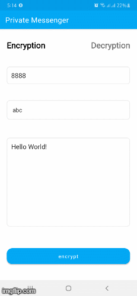

# Midterm Project

## Private Messenger 

Create a text application that sends encrypted text using standard SMS applications. From the sending end, you should create two activities: the first activity takes 3 letter alphanumeric encryption key, a number to send text using the encryption key. Encryption can be a simple substitution cipher or anything you want as long as applying the same encryption key to the same text can yield the same result. When the send button is pressed, it should append the 3 letter alphanumeric encryption key followed by a space and then the 150 character text before sending it to the SMS application. Do not send out the SMS yourself, it should open the SMS application activity from your application.

## Demo

