# FoodWare

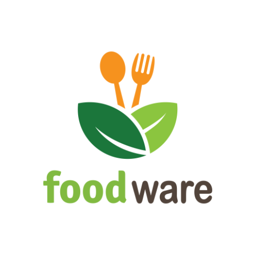 &emsp; *Divided by Malware, united by FoodWare.*

## Introduction
---
`Hungry?` Get the food you like, from the restaurants you know, served at eye twitch.
Eat just what you like, where you like, when you like. Find the local tastes you're looking for, all by clicking a button. Browse homamde and fast food favourites for inspiration. Or get just what you’re looking for by searching for a specific restaurant, dish or cuisine. If you're hungry, try Food Ware.

When you're ready to book your order, you'll see your shipping address, the approximate delivery time and the overall amount, including tax and booking fees. Tap your Bkash account to pay seamlessly.. Keep track of your order in real-time as it goes your way.

[download APk from here!](#)

## Features
---
#### JWT Token Based Authentication: 
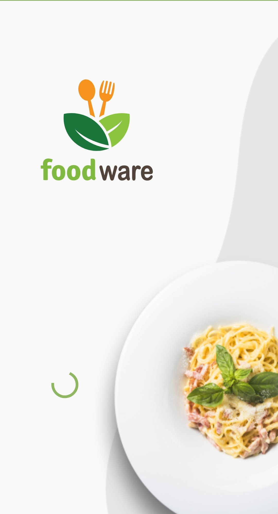
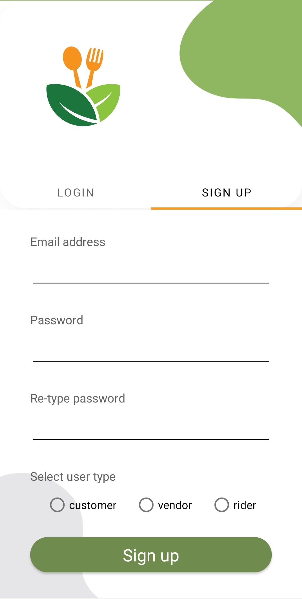
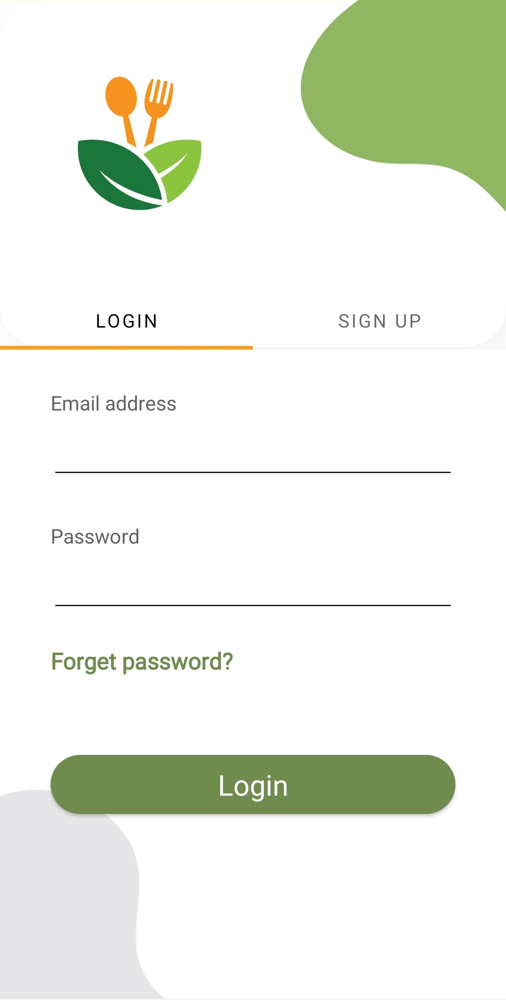

### Vendor 
### Collecting Permission on Runtime 
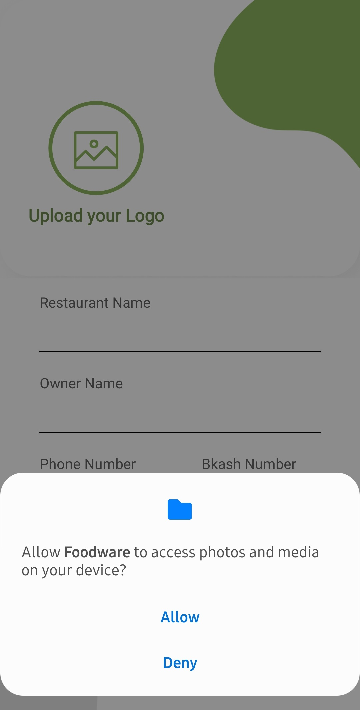
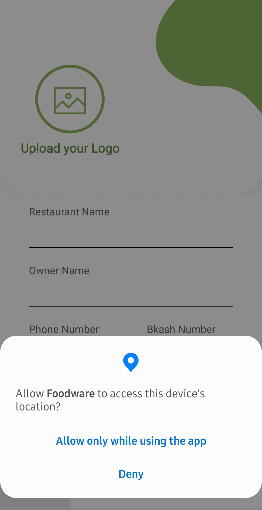

### Vendor UI
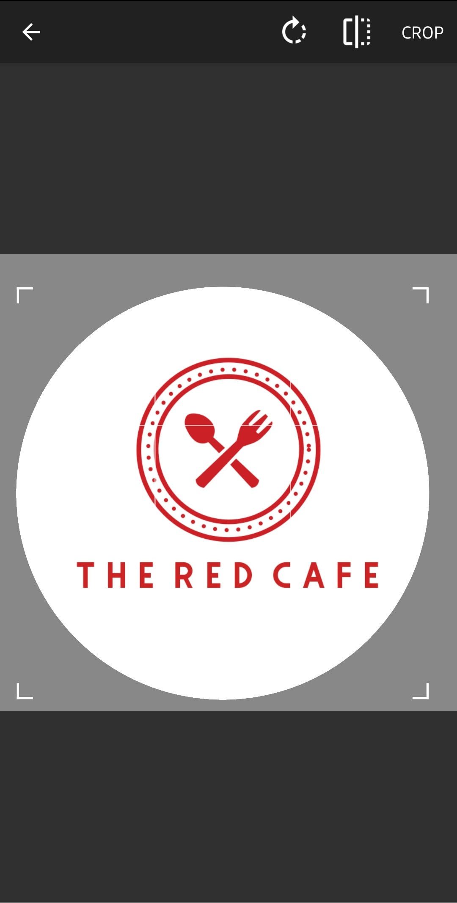
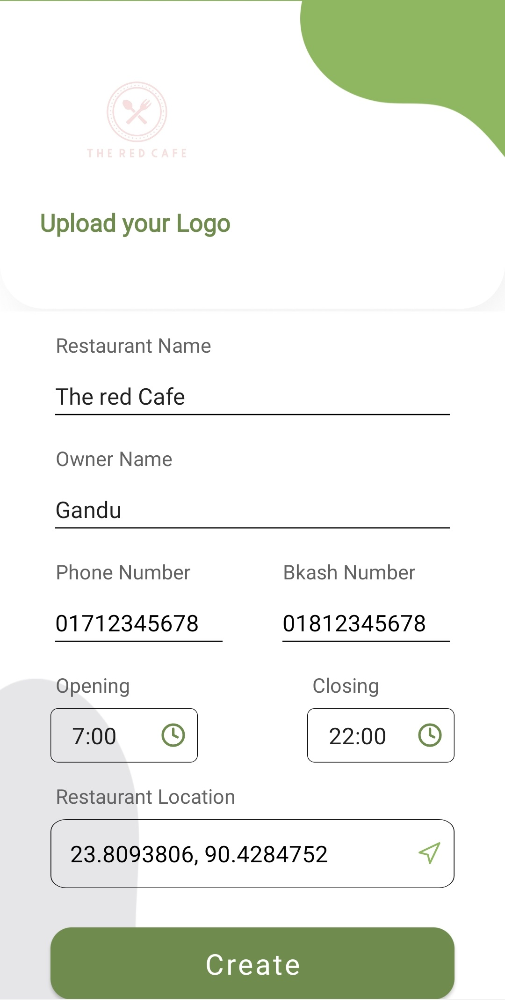
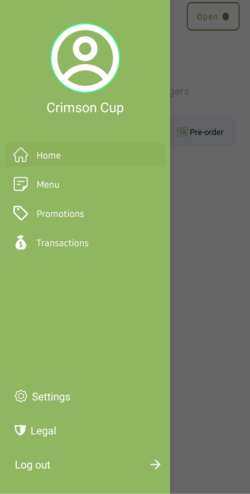
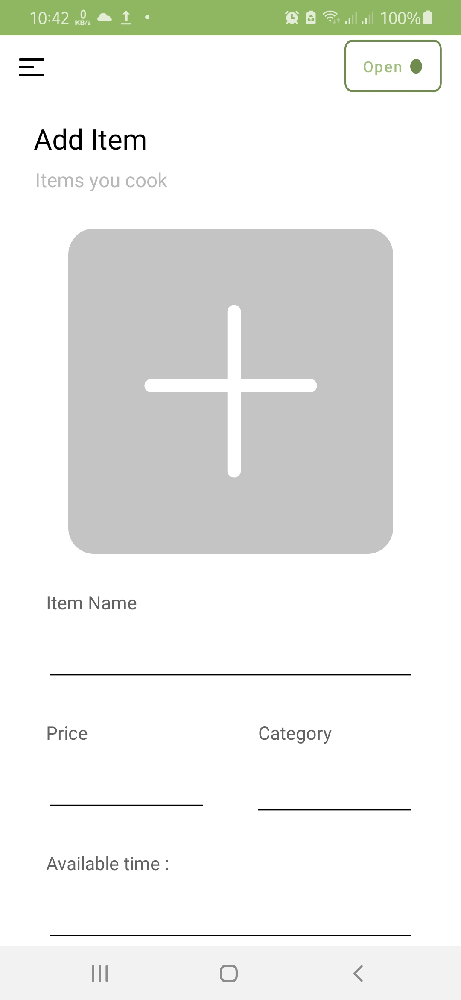

### Customer Feature
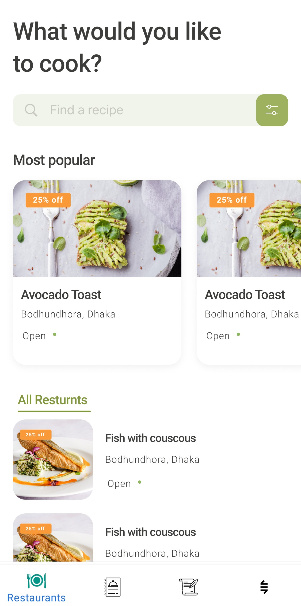
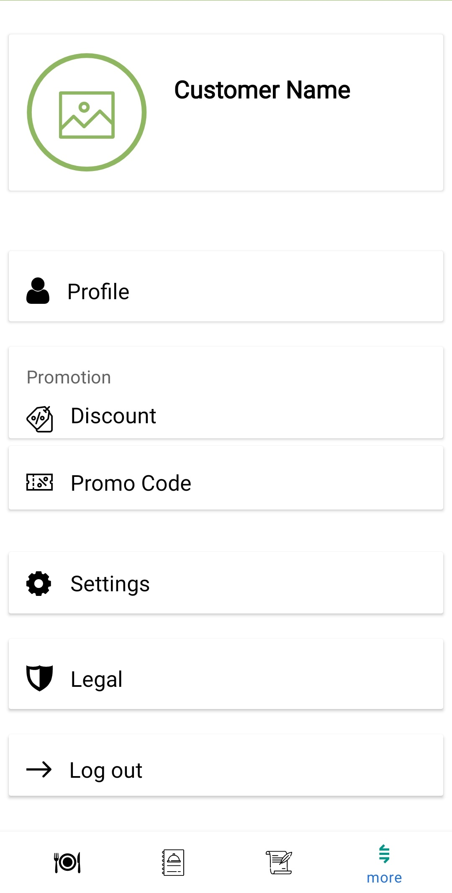  

## Data management
---
To Store data I used `MySQL` database. `MySQL` database is suitable and scalable for Management Applications. To solve business problems like Restaurant, cross platform might be needed for near future. So, I choose Relational Database to do the job. 

I used `ORM` instead of raw query. ORM has protection againts `SQL injection` by default. I found `sequelize` is the better `ORM` for node ecosystem. Using `sequelize` I also create tables.

To create routes, `express` is well known module for creating Backend application.  

Datbase Design API documention can be found here : [API Documentation](https://github.com/samiurprapon/foodware/blob/main/Server%20Code/README.md)

## Design Pattern
---

### Android
On client side I followed `MVC` architecture. But I used `singleton`, `adapter`, `memento` and `factory method` to improve the overall scenerio. Such as I choose `singleton` pattern to load `Fragment`, `Authentication`. Use `adapter` pattern to  load `recyclerview` data. 

### Server
Application backend server is built with `Nodejs` and `express`. Server side is developed using `MVC` Design Pattern. 

## Roadblocks
---
*Responsive UI* : Android's multiple screen size and ratio wa the first issue I faced. While porting the UI from Figma has a huge downside. Figma's generated Android code is not enough to implement in real application. Exporting `drawble` doesn't solve the porblem. I had to write boiler plate `XML` code for each drawbles. To reduce the number of drawable, I use built in drawbles such as `checkbox`, `selector` etc. 

*Android Emulator* : Android Device emulator is obselute for development. It is so juncky and sometime is stop working. After a certain period of time, Emulator shows a dialog box `System UI` stop working. I had to spend number of hours to fix my code and could find out the error later I found app works just fine on phone but on emulator it crashes. And Emulator issue couldn't be solve.

*Windows Ecosytem*: Windows is a piece of junk for development works. It restarts randomly. Update system without notifitying. Windows filesystem is worst we can think of. It creates issues with LF files. When I had no choice to change OS from Arch to Windows. I had to remove directory (e.g. `/.gitignore`). From nowhere stops MySQL server.  

*MySQL Server*: Choosing `Relational Database` instead of `Firebase` or `MongoDb` was a wrong decesion. Single handedly, working parallel on `Database Designning`, `API Documentaion`, `API integration` is huge mental pressure. At the same time, I face `windwos` issues. Fixing OS and server related issues killed most of the productive time. Using No-SQL database could reduce mental pressure and increase production.

## Developer info
------

All Rights Reserved

Copyright (c) 2021 Samiur Prapon

Created by [Samiur Prapon](https://samiurprapon.github.io)

THE SOFTWARE IS PROVIDED "AS IS", WITHOUT WARRANTY OF ANY KIND, EXPRESS OR
IMPLIED, INCLUDING BUT NOT LIMITED TO THE WARRANTIES OF MERCHANTABILITY,
FITNESS FOR A PARTICULAR PURPOSE AND NONINFRINGEMENT. IN NO EVENT SHALL THE
AUTHORS OR COPYRIGHT HOLDERS BE LIABLE FOR ANY CLAIM, DAMAGES OR OTHER
LIABILITY, WHETHER IN AN ACTION OF CONTRACT, TORT OR OTHERWISE, ARISING FROM,
OUT OF OR IN CONNECTION WITH THE SOFTWARE OR THE USE OR OTHER DEALINGS IN
THE SOFTWARE.